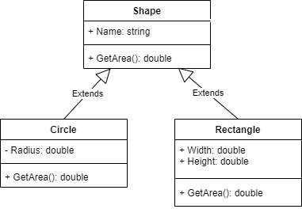

# Đa hình

Polymorphism

---

## Kỹ thuật đa hình

<center></center>

- Cơ chế đa hình (polymorphism) là một trong bốn đặc trưng quan trọng nhất của phương pháp lập trình hướng đối tượng.
- Hai đặc điểm mấu chốt của đa hình:
    - Tại thời điểm chạy ứng dụng, các đối tượng của lớp con có thể được xử lý như là đối tượng của lớp cha. Nói cách khác, một đối tượng của lớp cha có thể giữ một đối tượng của lớp con và gọi phương thức của lớp con đó. Khi đó, kiểu dữ liệu của đối tượng lúc khai báo và lúc thực thi chương trình là khác nhau.
    - Ở lớp cơ sở có thể cài đặt các phương thức ảo (virtual methods), ở các lớp dẫn xuất sẽ cài đặt các phương thức ghi đè (override methods). Khi chạy ứng dụng, trình điều khiển thực thi CLR (Common Language Runtime) sẽ gọi phương thức ghi đè của lớp con.

Cơ chế đa hình cho phép cài đặt một cách nhất quán các phương thức giống nhau của các lớp đối tượng khác nhau thông qua hai bước sau:

1. Tạo một lớp cơ sở chung của các loại đối tượng có liên quan với nhau. Sau đó cài đặt từng lớp dẫn xuất phù hợp với loại đối tượng cụ thể. Ở lớp cơ sở tạo phương thức ảo (virtual method), ở lớp dẫn xuất tạo phương thức ghi đè (override method).

2. Từ đối tượng của lớp cơ sở sử dụng phương thức ảo để gọi phương thức ghi đè ở lớp dẫn xuất.

## Bài toán ví dụ

Tạo ứng dụng sao cho khi chạy cho phép vẽ các hình khác nhau về hình dạng (vuông, tròn, tam giác,...), sau đó tìm hình vẽ có diện tích lớn nhất.

Bài toán này có thể giải quyết hiệu quả bằng kỹ thuật đa hình. Trước hết tạo lớp cơ sở Shape có phương thức ảo `GetArea()` để tính diện tích hình vẽ. Do Shape là lớp tổng quát, chưa biết hình vẽ cụ thể nên không tính được diện tích, vì thế cho kết quả trả về là `0`. Ở lớp dẫn xuất Circle có phương thức ghi đè `GetArea()`, ở đây đã biết loại hình vẽ cụ thể (hình tròn) nên tính được diện tích của nó. Tương tự như vậy với lớp dẫn xuất Rectangle (hình chữ nhật).

Trong chương trình chính tạo danh sách đối tượng thuộc lớp Shape nhưng khởi tạo thành 2 loại đối tượng khác nhau: 1 của lớp Circle và 1 của lớp Rectangle. Ta thấy, khi gọi phương thức tính diện tích của mỗi đối tượng, tùy theo kiểu của đối tượng cụ thể được tạo ra (hình tròn, hình chữ nhật) mà các dòng lệnh tính diện tích phù hợp được gọi.



```c#
// Tạo lớp hình vẽ tổng quát (Shape)
public class Shape
{
    // Phương thức ảo tính diện tích
    // Shape không phải hình vẽ cụ thể, nên không tính được diện tích
    public virtual double GetArea()
    {
        return 0;
    }
}// Kết thúc lớp Shape

// Tạo lớp hình tròn (Circle) kế thừa lớp hình vẽ
public class Circle : Shape
{
    public double Radius;   // Thuộc tính lưu độ dài bán kính

    // Constructor
    public Circle(double r = 0)
    {
        Radius = r;
    }

    // Phương thức ghi đè (override) tính diện tích hình tròn
    public override double GetArea()
    {
        return Math.PI * Radius * Radius;
    }
}// Kết thúc lớp Circle

// Lớp hình chữ nhật (Rectangle) kế thừa lớp hình vẽ
public class Rectangle : Shape
{
    public double Width;    // Các thuộc tính lưu kích thước hình chữ nhật
    public double Height;

    // Constructor
    public Rectangle(double w = 0, double h = 0)
    {
        Width = w;
        Height = h;
    }

    // Phương thức ghi đè tính diện tích hình chữ nhật
    public override double GetArea()
    {
        return Width * Height;
    }
} // Kết thúc lớp Rectangle

// Chương trình chính
class Program
{
    public static void Main()
    {
        // Tạo một danh dách các hình vẽ khác nhau
        var shapes = new List<Shape>
        {
            new Rectangle(9,6), // Hình chữ nhật (độ dài các cạnh)
            new Circle(1),      // Hình tròn (bán kính)
            new Circle(2.5),
            new Rectangle(6,9),
            new Circle(2.3)
        };

        // In thông tin của mỗi hình & tìm diện tích lớn nhất
        double maxArea = 0;
        foreach (var s in shapes)
        {
            Console.WriteLine("This is a {0}, area = {1:0.000}", s.GetType(), s.GetArea());
            if (s.GetArea() > maxArea) maxArea = s.GetArea();
        }

        // In thông tin (các) hình vẽ có diện tích lớn nhất
        Console.WriteLine("Cac hinh ve co dien tich lon nhat:");
        for (int i = 0; i < shapes.Count; i++)
            if (shapes[i].GetArea() == maxArea)
            {
                Console.WriteLine("Index = {0}, type: {1}, area = {2:0.000}", i, shapes[i].GetType(), shapes[i].GetArea());
            }
    }
}

/* Output
This is a Rectangle, area = 54.000
This is a Circle, area = 3.142
This is a Circle, area = 19.635
This is a Rectangle, area = 54.000
This is a Circle, area = 16.619
Cac hinh ve co dien tich lon nhat:
Index = 0, type: Rectangle, area = 54.000
Index = 3, type: Rectangle, area = 54.000
*/
```

([Xem trên GitHub](https://github.com/nd-hung/oop/tree/main/docs/topics/polymorphism/code/Shape/))

